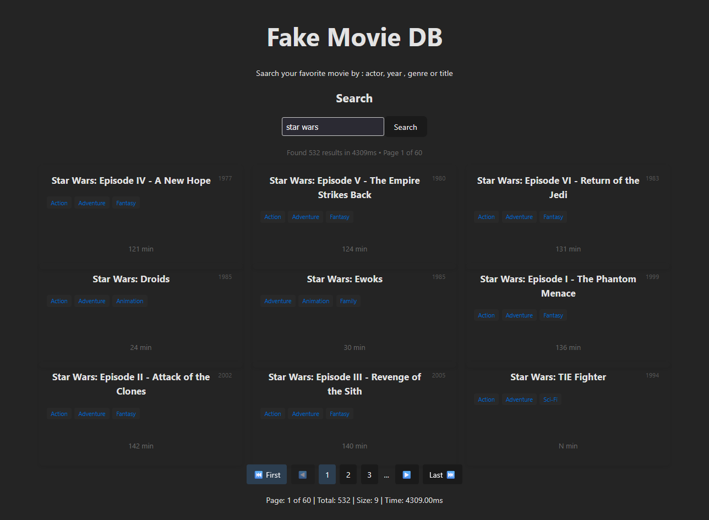
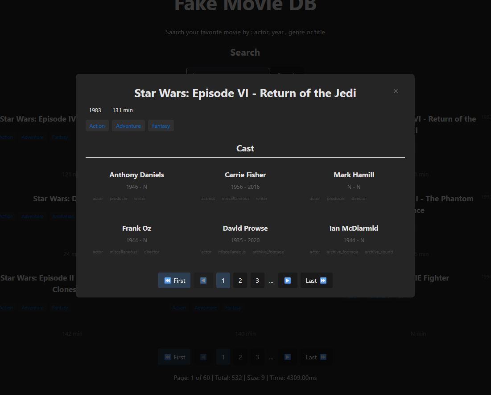

# fake-movie-db



A full-stack application for searching movies by title, actor, or genre. Built with .NET Core EF backend, deno and React frontend, and SQL Server database all of them running in docker containers.

## Requirements

- Each movie needs to be associated with one or more actors or actresses.
- The search of one movie should be possible by title, genre or actor/actress name.
- The result of the search should be represented on the same page below the input search.

## Goals

- Search Movie by title, actor, or genre.
- Show results of search in /
- Show Actors related in a movie in a new component

## Architecture

- All systems will be running on Docker containers

- DB - SQL-Server 2022 container
- Backend - .NET Core
- Frontend - NextJS (React Vite)

## Dataset

The dataset was taken from [IMDb](https://developer.imdb.com/non-commercial-datasets/) and only using the following files : 

- title basics
- name basics

based on the requirements of the assignment and with date of 18 March 2025: [datasets](https://datasets.imdbws.com/) and need to be upload to your MS-SQL server instance.

### DB

```bash
# get the latest SQL Server container.
docker pull mcr.microsoft.com/mssql/server:2022-latest
```




## Development 


### TL:DR

```bash
docker compose up -build
```

### DB and API

To run the dev environment just run:
```bash
cd ./api
dotnet run
```

To set your connection string in a development instance:

```bash
export ConnectionStrings__FakeMovieDB="Server=host.docker.internal;Database=FakeMovieDb;User Id=sa;Password=<yoursupersecurepassword>;Encrypt=False;TrustServerCertificate=True"
```

To initialize the db just run the following commands:
```bash
# might be necessary to install the tool 
dotnet tool install --global dotnet-ef

# add the Initial Migration
dotnet ef migrations add InitialMigration
dotnet ef database update

# you could undo this action, use:
dotnet ef migrations remove

# Now you are ready to upload the data from the datasets.
```

### Frontend

> Requirements:
    [Deno](https://docs.deno.com/deploy/manual/)

```bash
cd ./frontend
deno install
deno run dev
```

## Journal

- First, after defining what I wanted to build and the tools based on the requirements, I started to create the docker compose with the Windows Server DB using the information taken from [here](https://learn.microsoft.com/en-us/sql/linux/quickstart-install-connect-docker?view=sql-server-ver16&tabs=cli&pivots=cs1-bash)

- I took this Sunday to configure the API, and due to my lack of practice it took more time than I expected. In general, in enterprises the DB is already configured.

I also had many issues configuring [ODBC 17](https://learn.microsoft.com/en-us/sql/connect/odbc/linux-mac/installing-the-microsoft-odbc-driver-for-sql-server?view=sql-server-ver16&tabs=ubuntu18-install%2Cubuntu17-install%2Cdebian8-install%2Credhat7-13-install%2Crhel7-offline) and MSSQL on Docker and Ubuntu for development.

After investigating how to connect the API to MSSQL and uploading the datasets using DBeaver, I built the Controller. One of my goals was to simplify the next step, so I added pagination in the search call.

In a second version of this API, I want to increase performance using only documentation and hard work, but now I need speed.

Now it's time for the last part, the frontend...

(You could check the time of these messages by doing a commit blame or with git intellisense)

For the Frontend, I chose DENO because it uses TypeScript by default, forcing me to use it. I installed SASS to work more comfortably with CSS. I know Tailwind but I prefer the control of more pure CSS.

Now with a first approach to the frontend, it's time to give life to the search component and create the results components.

As final words, I completed the frontend, but I started to "vibe coding" at the end to be faster.

It works well in the way I wanted it to be displayed and function (using hooks for example), and I learned a thing or two.

Using AI to create a fast implementation works, but it's like creating a new old project, full of tech debt and "code that you need to understand and read that someone coded years ago" - instant legacy code.

Another thing I was thinking while building this: this is a great project to learn from and improve. In general, most people only call an API to create the frontend, but in this case it was necessary to create the DB, fill it with data, and create the API. I have some ideas to optimize the tables and queries. Also, I want to recreate the UI again, without UI frameworks.

This will be a fun side project.
